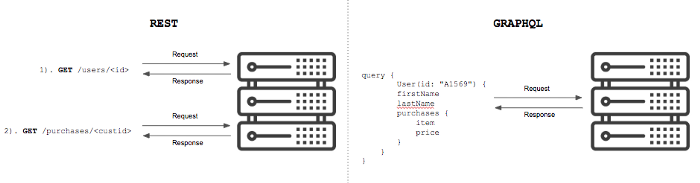

## GRAPHQL (Graphene Framework)


GraphQl est un langage de requête crée par Facebook . Il améliore l'architecture API REST et permet un retour des données sur différents shémas.




Comme vous pouvez le voir, il y a qu'un seul point de terminaison contrairement au API REST 

## Installation 

```
virtualenv venv
.\venv\Scripts\activate
```
ATTENTION : GraphQL ne fonctionne pas très bien avec la version 4 de Django.
```
pip install Django==3.1.7
pip install pillow
pip install graphene-django
```

```
django-admin startproject core
cd core
django-admin startapp products
py manage.py startapp orders
py manage.py startapp carts
```

settings.py 
```py
# Application definition

INSTALLED_APPS = [
    'django.contrib.admin',
    'django.contrib.auth',
    'django.contrib.contenttypes',
    'django.contrib.sessions',
    'django.contrib.messages',
    'django.contrib.staticfiles',
    'products', # ajout
    'orders', # ajout
    'carts', # ajout
    'graphene_django', # ajout
]


...

MEDIA_URL = '/media/'
MEDIA_ROOT = BASE_DIR / 'media/'
```
## Models
products/models.py :
```py
from django.db import models
from django.contrib.auth.models import User
class Category(models.Model): 
    name = models.CharField(max_length=50)
class SubCategory(models.Model): 
    name = models.CharField(max_length=50)
    category = models.ForeignKey(Category, 
            related_name='subCategories', 
            on_delete=models.CASCADE)
class Product(models.Model): 
    name = models.CharField(max_length=100)
    category = models.ForeignKey(Category, 
            related_name='products', 
            on_delete=models.CASCADE)
    subCategory = models.ForeignKey(SubCategory,
            related_name='products', 
            on_delete=models.CASCADE)
    description = models.TextField() 
    price = models.PositiveIntegerField() 
    amount_in_stock = models.PositiveIntegerField()
class ProductImage(models.Model): 
    product = models.ForeignKey(Product, 
            related_name='images', 
            on_delete=models.CASCADE)
    image = models.ImageField(upload_to='productImages/')
class Rating(models.Model): 
    product = models.ForeignKey(Product, 
            related_name='ratings', 
            on_delete=models.CASCADE)
    stars = models.PositiveIntegerField()
    note = models.TextField()
    rating_from = models.ForeignKey(User,
            related_name='ratings_given', 
            on_delete=models.CASCADE)
    created_on = models.DateTimeField(auto_now_add=True)
class Comment(models.Model): 
    product = models.ForeignKey(Product, 
            related_name='comments', 
            on_delete=models.CASCADE)
    comment_from = models.ForeignKey(User, 
            related_name='comments_given', 
            on_delete=models.CASCADE)
    body = models.TextField() 
    created_on = models.DateTimeField(auto_now_add=True)
```


core/urls.py :
```py
from django.contrib import admin
from django.urls import path
from django.conf import settings # ajout
from django.conf.urls.static import static # ajout

urlpatterns = [
    path('admin/', admin.site.urls),
    path("graphql/", GraphQLView.as_view(graphiql=True)), # ajout
]+ static(settings.MEDIA_URL, document_root=settings.MEDIA_ROOT) # ajout
```


https://sk-soyeb-akhter.medium.com/e-commerce-graphql-api-with-django-python-a9ef74fad4b


orders/models.py :

```py
from django.db import models
from products.models import Product
from django.contrib.auth.models import User

STATUS_CHOICES = [
    ('created', 'Created'),
    ('processing', 'Processing'),
    ('cancelled', 'Cancelled'),
    ('delivered', 'Delivered'),
]
class Order(models.Model): 
    product = models.ForeignKey(Product, 
            related_name='orders', 
            on_delete=models.CASCADE)
    order_from = models.ForeignKey(User, 
            related_name='orders_given', 
            on_delete=models.CASCADE)
    status = models.CharField(max_length=20,
            default="created", 
            choices=STATUS_CHOICES)
    created_on = models.DateTimeField(auto_now_add=True)
```

carts/models.py :
```py
from django.db import models
from products.models import Product 
from django.contrib.auth.models import User

class Cart(models.Model): 
    account = models.OneToOneField(User, 
            related_name='cart', 
            on_delete=models.CASCADE)
class CartItem(models.Model): 
    cart = models.ForeignKey(Cart, 
            related_name='items', 
            on_delete=models.CASCADE)
    product = models.ManyToManyField(Product, 
            related_name='product')
    amount = models.PositiveIntegerField(default=1)
```

```
py manage.py makemigrations
py manage.py migrate
```
## Admin
products/admin.py :
```py
from django.contrib import admin

from .models import (
    Category, 
    SubCategory, 
    Product, 
    ProductImage, 
    Rating, 
    Comment,
)
admin.site.register(Category)
admin.site.register(SubCategory)
admin.site.register(Product)
admin.site.register(ProductImage)
admin.site.register(Rating)
admin.site.register(Comment)
```

orders/admin.py :
```py
from django.contrib import admin
from .models import Order
admin.site.register(Order)
```

carts/admin.py :
```py
from django.contrib import admin
from .models import Cart, CartItem
admin.site.register(Cart)
admin.site.register(CartItem)
```

```
py manage.py createsuperuser
```

## schema

products/schema.py : 
```py
import graphene 
from graphene_django import DjangoObjectType
from .models import (
    Category, 
    SubCategory, 
    Product, 
    ProductImage, 
    Rating, 
    Comment,
)
class ProductType(DjangoObjectType): 
    class Meta: 
        model = Product
class Query(graphene.ObjectType): 
    all_products = graphene.List(ProductType)
    def resolve_all_products(root, info): 
        return Product.objects.all()
```

core/schema.py :
```py
import graphene
import products.schema
class Query(products.schema.Query, graphene.ObjectType):
    pass
schema = graphene.Schema(query=Query)
```

settings.py :
```py
...
GRAPHENE = {
    "SCHEMA": "core.schema.schema"
}
```